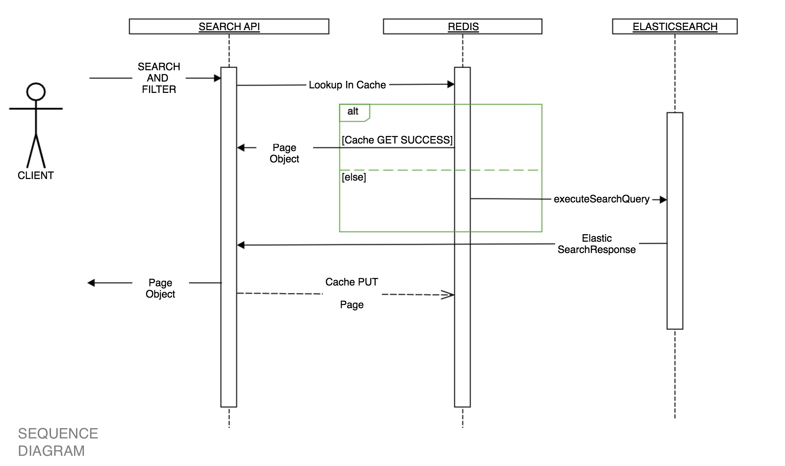

# User Search

Example app:
1. Spring boot on Docker with Elastic Search and Redis
2. Indexing and Searching

REST endpoint that provides Search and Filter capability over the User searches info. Here are the query parameters/capabilities we expect to see:
1. search
2. maxAge
3. minAge
The clients of this API should be able to provide any combination of these parameters and get the User searches matching all the criteria.

## Features and Tools
1. This application loads usersearch info from an public http source https://randomuser.me/documentation#howto and on-demand
2. It provides basic search feature
3. It uses the power of elasticsearch
4. It also caches result using redis for performance (default 1 min)

##Sequence Diagram



## Running the application
- Please have gradle 5+ and recent version of docker installed
- This application is containerized using jib gradle plugin: https://github.com/GoogleContainerTools/jib
- Advantage of containerizing the application is that it can run as an image anywhere using docker. so difference in
local, test and prod are minimal
- It also uses a redis image for caching demonstration

For demo purposes - There is a elasticsearch and redis image run in tandem with the spring boot application

For test and prod - 
  1. Comment out elastic and redis section in docker-compose.yaml
  2. Then we can create appropriate application-test and application-properties file to make the app point to a hosted elasticsearch

**TO START THE APPLICATION**

First build the application using ```./gradlew clean build```
This will create the image `usersearch`

We can then start the application and elasticsearch image together.
```
docker-compose up
```

**TO STOP THE APPLICATION**
```
docker-compose down
```

## Usage

The detailed usage of the api is in the api.yaml file. There are two end points:

### POST Endpoint for reindex:
  1. Since reindex is a domain command its a POST endpoint which returns 202 (and not get)
  2. Before starting to search, we need to load source data to Elastic index
  3. Internally we use ElasticSearch's Java High Level Rest client 
     along with elastic's asynchronous BulkProcessor api
  
  EXAMPLE:
```bash
curl -X POST \
  http://localhost:8080/users/v1/reindex \
  -H 'Accept: */*' \
  -H 'Cache-Control: no-cache' \
  -H 'Content-Type: application/json' 
```     

### GET Endpoint for search:

  1. The response model has usersearch list, page number etc.
  2. For now page size is set to 30 but making it variable.
  
  EXAMPLE:
  ```bash
curl -X GET \
  'http://localhost:8080/users/v1/searches?search=male&pageNumber=15' \
  -H 'Accept: */*' \
  -H 'Cache-Control: no-cache' \
  -H 'Content-Type: application/json' \
  -H 'cache-control: no-cache'
```

### GET Endpoint for about:
  1. An about endpoint can be used to check status of the application, 
     and whether it has connected to elasticsearch cluster.
     
  EXAMPLE:
  ```bash
curl -X GET \
  http://localhost:8080/about \
  -H 'Accept: */*' \
  -H 'Cache-Control: no-cache' \
  -H 'Content-Type: application/json'
```